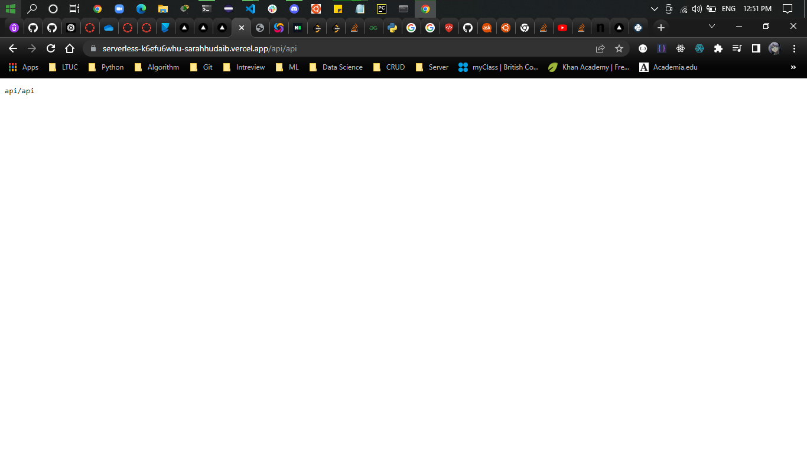

# Serverless API 
this app will show the path of whatever the user typed in the browser

## Methods
- `do_GET(self)` will handle GET requests and send back the response
- `main ()` this function will start the server and listen for requests

## Result

### from vercel side 

### [Vercel Link](https://serverless-k6efu6whu-sarahhudaib.vercel.app/api/api)

