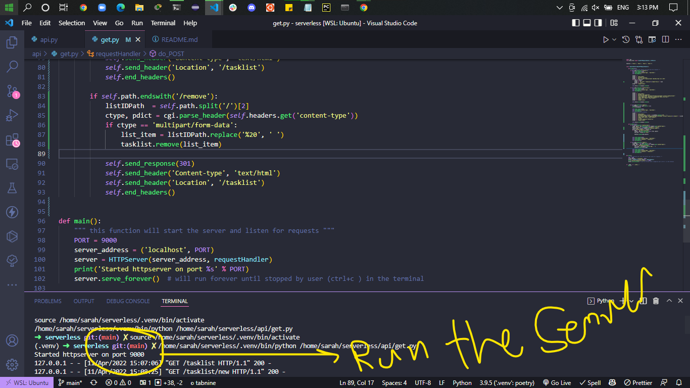
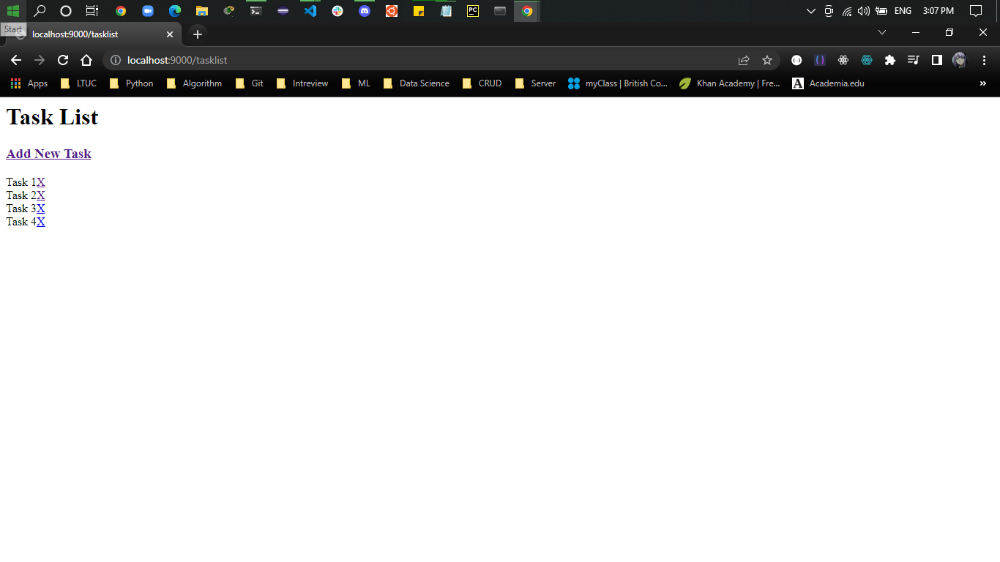
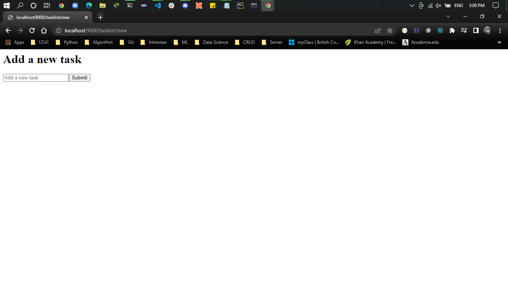
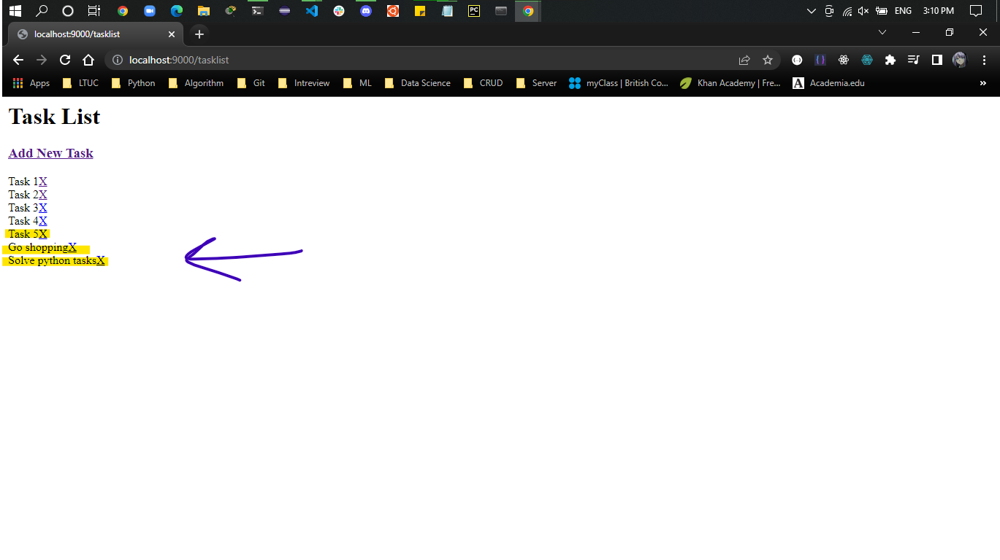
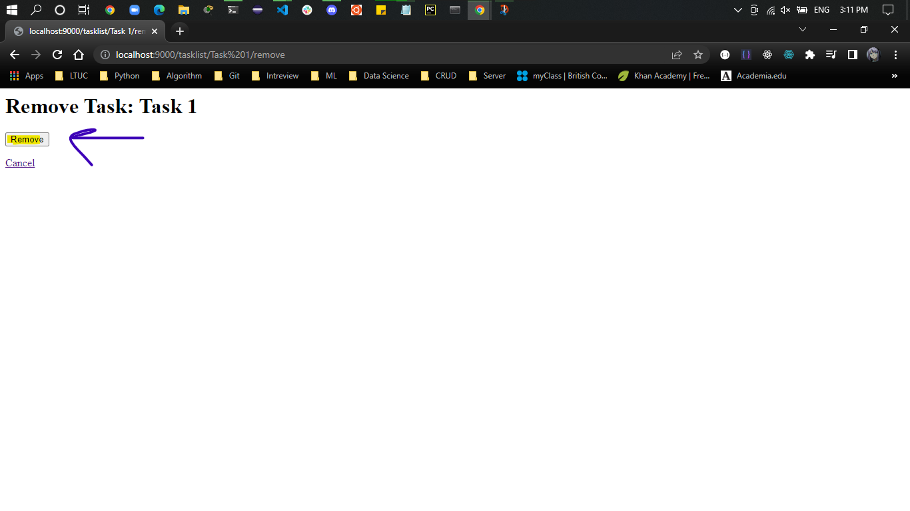
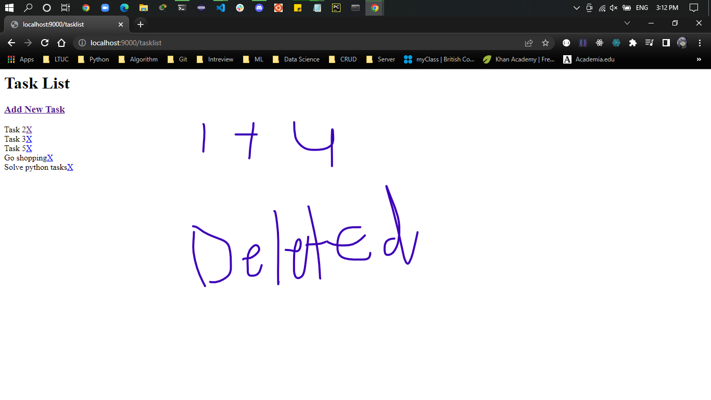

# Tasks List 
In this program we can add new tasks to a list and then after ending these tasks we can decide to delete them or not

## First thing we need to run the server

## Then in the localhost we will see the first page i created

## Press the link "`Add New Task`" to go to a new page to add new tasks

## I added new 3 tasks 

## Now if i want to delete any task i can press on the `X` button to go to the `Removing Task` page

## We can see that i deleted 2 items

http://localhost:9000/tasklist